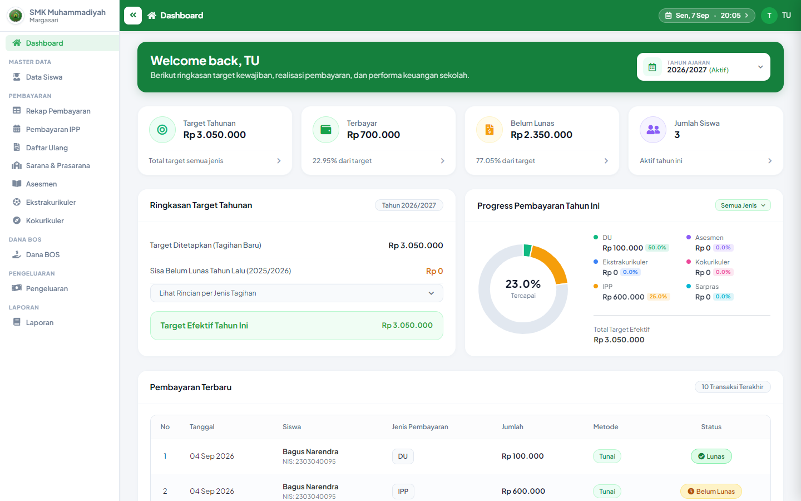
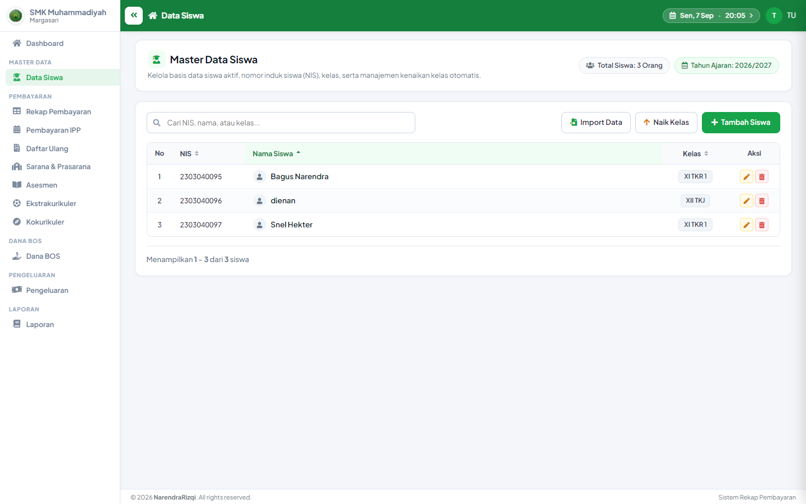
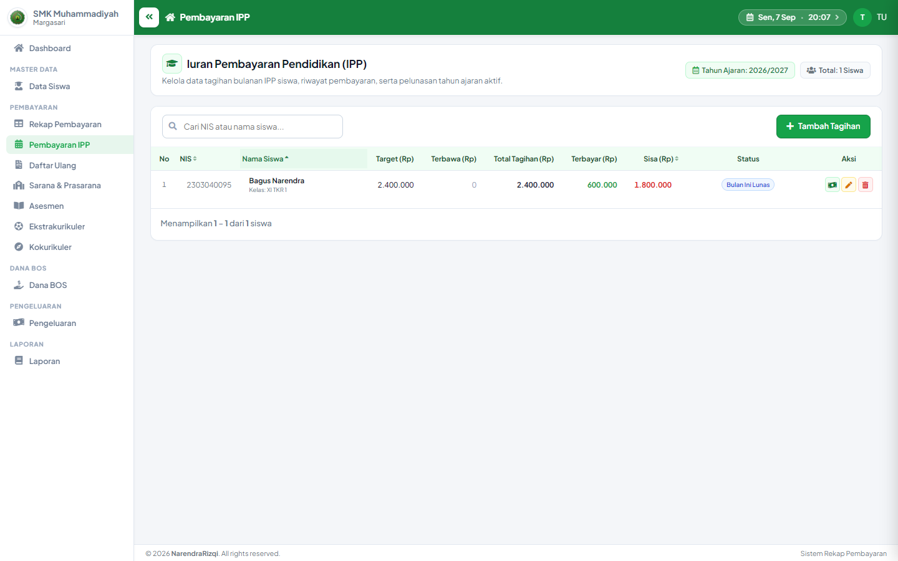
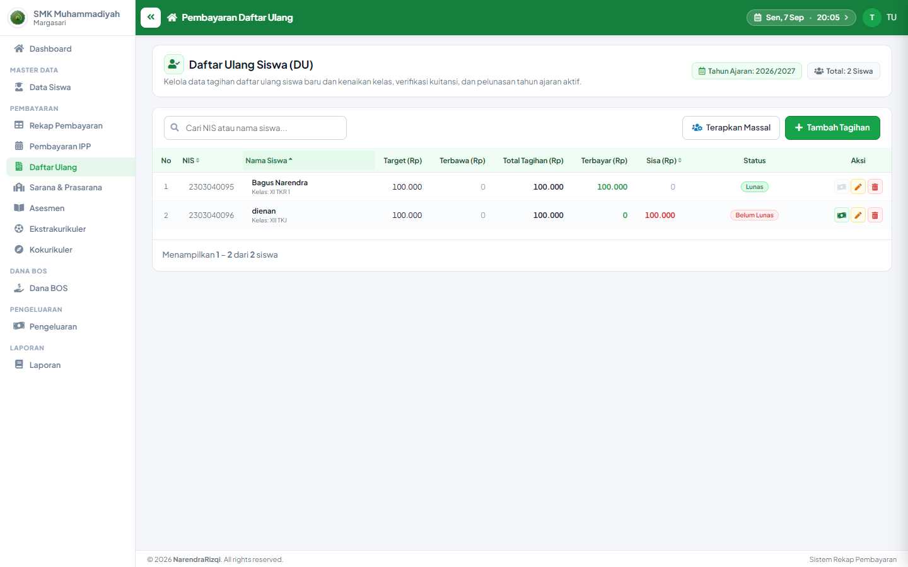
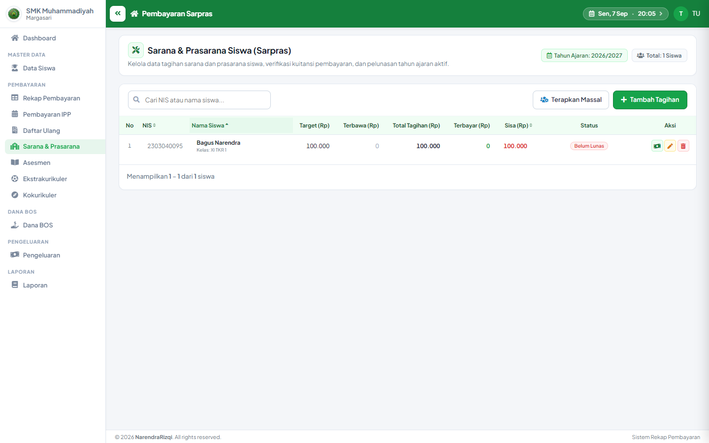
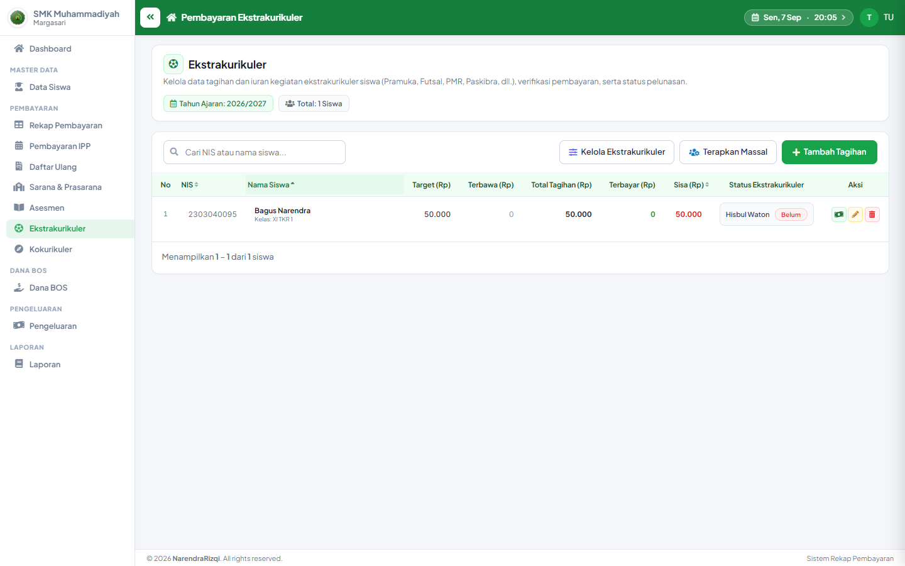
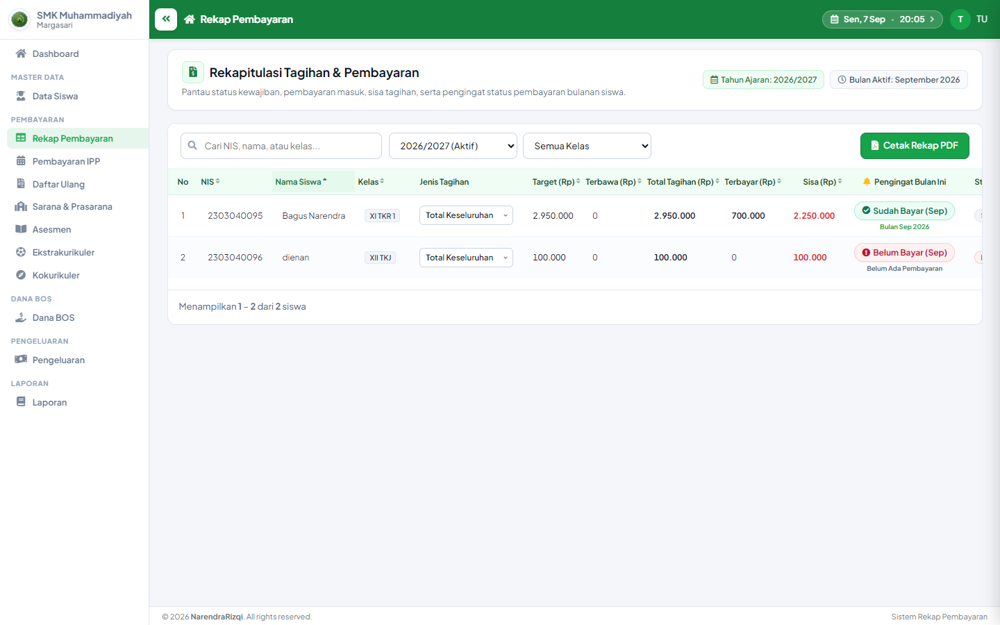
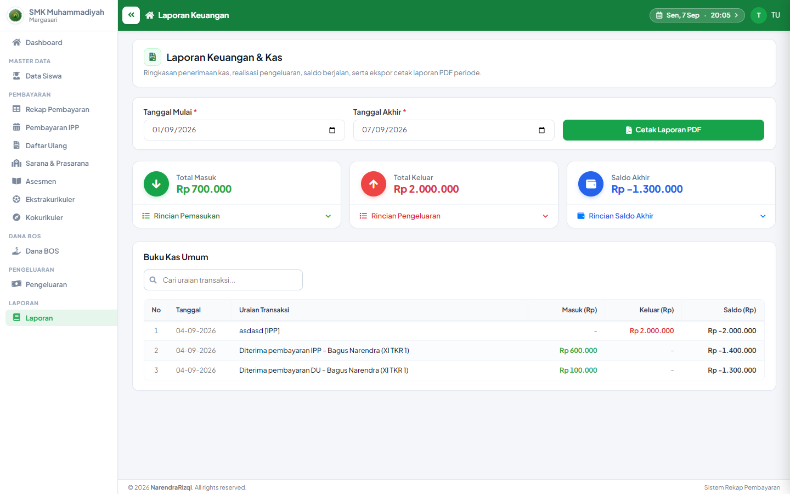
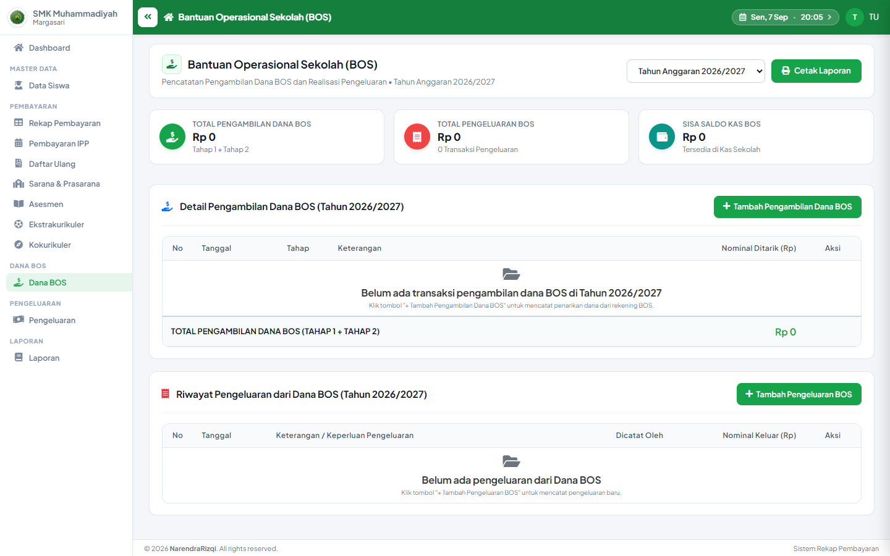
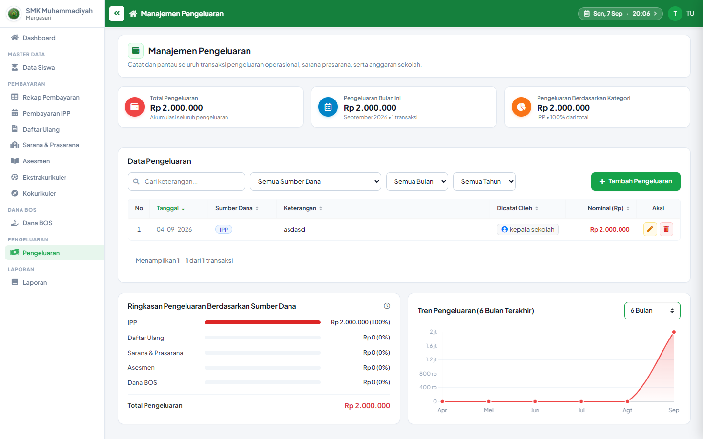

# Sistem Administrasi Pembayaran SMK

Sistem administrasi pembayaran berbasis web yang dikembangkan
untuk membantu pengelolaan administrasi pembayaran sekolah.

## Fitur

- Dashboard administrasi
- Data siswa
- Pembayaran IPP
- Daftar Ulang
- Sarana & Prasarana
- Asesmen
- Ekstrakurikuler
- Kokurikuler
- Rekap pembayaran
- Laporan pembayaran
- Dana BOS
- Pengeluaran
- Target tahunan
- Pengelolaan tahun ajaran

## Teknologi

- Laravel
- PHP
- MySQL
- Blade
- JavaScript
- Bootstrap

## Screenshot

## Catatan

Project ini dikembangkan sebagai bagian dari kegiatan Kerja Praktik.